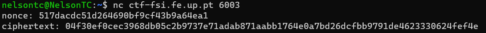
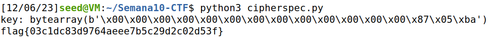

# SEED Labs - Secret Key Encryption

## TASK 1

- Começamos por executar o ficheiro freq.py de forma a percebermos a frequência das letras/conjuntos de letras. De seguida vimos as palavras de três letras mais utilizadas na língua inglesa e subsituímos a palavra com mais frequência no freq.py (ytn) pela palavra de três letras mais utilizada na língua inglesa(the), através do código `` tr 'ytn' 'THE' < ciphertext.txt > out.txt ``.
- Fomos efetuando mais trocas até consguirmos perceber o texto.
- A últims troca que realizámos até ser completamente possível perceber o texto foi ```tr 'ytnvxupmhqidzcbarflges' 'THEAONDIRSLYUMFCGVWBPK' < ciphertext.txt > out.txt` ```.
- Este foi o primeiro parágrafo do texto "THE OSCARS TURN  ON SUNDAY WHICH SEEMS ABOUT RIGHT AFTER THIS LONG STRANGE
AWARDS TRIP THE BAGGER FEELS LIKE A NONAGENARIAN TOO"

## TASK 2

- Começamos por executar o comando ```man enc``` para percebermos melhor os diferentes tipose de criptografia.
- Experimentamos encriptar um fichiro de texto com os seguintes tipos de criptografia -aes-128-cbc, -bf-cbc,
-aes-128-cfb.

## TASK 3

- Começamos por separar a imagem em header e body.
- De seguida, encriptamos apenas o body pelo modo ECB com o comando ```openssl enc -aes-128-ecb -e -in body -out body2 -K  00112233445566778889aabbccddeeff```.
- Experimentamos visualizar a imagem depois de juntarmos o body com o header atraves do comando ```eog new.bmp```. Percebemos que esta encriptação permite continuarmos a percerber a imagem.
- Por fim encriptamos segundo o modo CBC com o comando ```openssl enc -aes-128-cbc -e -in body -out body2 -K 00112233445566778889aabbccddeeff -iv 0102030405060708```. Visuzalizando esta imagem, não era possível perceber o seu conteúdo.
- Concluímos que a segunda encriptação foi mais forte.


## CTF semana \#10 (Weak Encryption)

#### Investigação

Ao acedermos a **nc ctf-fsi.fe.up.pt 6003** obtinhamos o **nonce** e **ciphertext** 



Também tinhamos acesso ao ficheiro **cipherspec.py** que tinha um truque que acelerava a cifração de mensagens com apenas uma linha de código, no entanto esse truque era uma vulnerabilidade.

#### Vulnerabilidade

A vulnerabilidade consiste na linha `offset = 3` que era usada na geração da **key** criando um bytearray que não tinha muita variação, apenas nos 3 últimos bytes, sendo assim possível de achar pelo método de **brute-force** em tempo viável.

#### Código utilizado

Utilizámos o sequinte código para fazer iterar por todas as key possíveis até encontrarmos uma mensagem que iniciasse por **"flag{"**.

```py
from cryptography.hazmat.primitives.ciphers import Cipher, algorithms, modes
from cryptography.hazmat.backends import default_backend
import os
import binascii

def dec(k, c, nonce):
	cipher = Cipher(algorithms.AES(k), modes.CTR(nonce), backend=default_backend())
	decryptor = cipher.decryptor()
	msg = b""
	msg += decryptor.update(c)
	msg += decryptor.finalize()
	return msg


def increment_bytearray(byte_array):
    index = len(byte_array) - 1
    while index >= 0:
        byte_array[index] = (byte_array[index] + 1) % 256
        if byte_array[index] != 0:
            break
        index -= 1
    return byte_array

def exploit():
	k = bytearray(b'\x00'*(KEYLEN))
	c = binascii.unhexlify("04f30ef0cec3968db05c2b9737e71adab871aabb1764e0a7bd26dcfbb9791de4623330624fef4e")
	nonce = binascii.unhexlify("517dacdc51d264690bf9cf43b9a64ea1")

	res = b""
	while not res.startswith(b'flag{'):
		#print(k)
		res = dec(bytes(k),c,nonce)
		k = increment_bytearray(k)
		
	print('key:', k)
	print(res.decode())
	return res.decode()

exploit()
```

Obtívemos a seguinte flag para a seguinte key:




#### Prevenção

Respeitar as "boas práticas" da criptografia.
