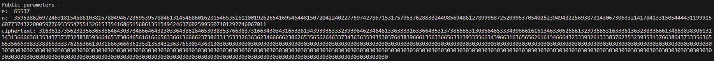

# Public-Key Infrastructure (PKI) Lab

## Task 1: Becoming a Certificate Authority (CA)

 O objetivo era emitir certificados digitais sem pagar a CAs comerciais.


1. **Preparação do ficheiro de configuração:**
   - Copiamos o arquivo de configuração padrão do OpenSSL, `openssl.cnf`, do diretório `/usr/lib/ssl` para o nosso diretório atual.
   - Modificamos o arquivo para se adequar às necessidades da CA, a descomentar a linha `unique_subject = no` na seção `[ CA_default ]`.

2. **Geração do nosso CA:**
   - Executamos o comando OpenSSL para gerar um certificado autoassinado para o nosso CA:
     ```bash
     openssl req -x509 -newkey rsa:4096 -sha256 -days 3650 \
                 -keyout ca.key -out ca.crt \
                 -subj "/CN=www.modelCA.com/O=Model CA LTD./C=US" \
                 -passout pass:dees
     ```
   - Isso resultou na criação de duas chaves: `ca.key` (chave privada) e `ca.crt` (certificado de chave pública).

   - Para verificar o conteúdo do certificado X509 e da chave RSA, utilizamos os comandos:
     ```bash
     openssl x509 -in ca.crt -text -noout
     openssl rsa -in ca.key -text -noout
     ```

Identificamos que o certificado era de uma CA através do campo `Basic Constraints` com `CA:TRUE`. Confirmamos que era autoassinado pela igualdade nos campos `Issuer` e `Subject`. No RSA, observamos o expoente público (e), expoente privado (d), módulo (n) e os números primos (p, q).

~~~bash
Labsetup $ openssl x509 -in ca.crt -text -noout
openssl rsa -in ca.key -text -noout

Certificate:
    Data:
        Serial Number:
            4c:f0:b8:63:86:f8:11:97:8d:d7:f2:2c:8c:f3:f7:2c:c4:b6:be:5a
        Issuer: CN = www.modelCA.com, O = Model CA LTD., C = US
        Validity
            Not Before: Dec  5 13:23:11 2023 GMT
            Not After : Dec  2 13:23:11 2033 GMT
        Subject: CN = www.modelCA.com, O = Model CA LTD., C = US
        Subject Public Key Info:
            Public Key Algorithm: rsaEncryption
                Public-Key: (4096 bit)
                Modulus: [omitted for brevity]
                Exponent: 65537 (0x10001)
        X509v3 extensions:
            X509v3 Basic Constraints: critical
                CA:TRUE

Private-Key: (4096 bit, 2 primes)
modulus: [omitido para brevidade]
publicExponent: 65537 (0x10001)
privateExponent: [omitido para brevidade]
prime1: [omitido para brevidade]
prime2: [omitido para brevidade]
exponent1: [omitido para brevidade]
exponent2: [omitido para brevidade]
coefficient: [omitido para brevidade]
~~~

## Task 2: Generating a Certificate Request for Your Web Server

O objetivo desta tarefa é gerar uma CSR para o nosso servidor `www.l08g082023.com`, incluindo nomes alternativos no certificado.


1. **Geração da Chave Pública/Privada e CSR:**
   - Executamos o seguinte command para gerar um par de chaves pública/privada e a CSR:
     ```bash
     openssl req -newkey rsa:2048 -sha256 \
                 -keyout server.key -out server.csr \
                 -subj "/CN=www.l08g082023.com/O=SeedServer Inc./C=US" \
                 -passout pass:dees
     ```
   - Isso cria a (`server.key`) e a CSR (`server.csr`).

   - Para verificar o conteúdo decodificado da CSR e da chave privada, usamos:
     ```bash
     openssl req -in server.csr -text -noout
     openssl rsa -in server.key -text -noout
     ```

     screenshot

Para abranger vários nomes de host no certificado, utilizamos a extensão SAN.

1. **Incluindo SAN na CSR:**
   - Modificamos o comando para adicionar nomes alternativos (SAN) na CSR.
     ```bash
     openssl req -newkey rsa:2048 -sha256 \
                 -keyout server.key -out server.csr \
                 -subj "/CN=www.l08g082023.com/O=SeedServer Inc./C=US" \
                 -addext "subjectAltName = DNS:www.l08g082023.com, DNS:www.seed-server.com, DNS:www.zacarias2023.com, DNS:www.bank32.com" \
                 -passout pass:dees
     ```

    screenshot

## Task 3: Generating a Certificate for your server

Nesta tarefa, nosso objetivo é assinar a CSR do servidor `www.l08g082023.com` com nossa própria CA para formar um certificado.

### Assinando a CSR com a CA:

   - Utilizamos o arquivo de configuração `myopenssl.cnf` da Task 1.

   - Para permitir que a extensão SAN da CSR seja copiada para o certificado final descomentamos a linha `copy_extensions = copy`

   - Com a CSR (`server.csr`) e as chaves da CA (`ca.crt` e `ca.key`), geramos o certificado para o servidor:
     ```bash
     openssl ca -in server.csr -out server.crt -config myopenssl.cnf \
                 -extensions v3_req -extfile myopenssl.cnf \
                 -policy policy_anything
     ```

   - Para confirmar que o certificado foi gerado corretamente e inclui os nomes alternativos, executamos:
     ```bash
     openssl x509 -in server.crt -text -noout
     ```

    screenshot

> Movemos os ficheiros `ca.crt` e `ca.key` para novos diretorios dentro do demoCA. As linhas no `myopenssl.cnf` que apontavam para `./demoCA/private/cakey.pem` e `./demoCA/cacert.pem` foram atualizadas para o novo path.

Com esses passos, assinamos a CSR para `www.l08g082023.com` com nossa CA, gerando um certificado que inclui os nomes alternativos especificados. Tornando este certificado pronto para utilizar no nosso servidor.

## CTF Semana \#11 - (RSA)

A partir de `nc ctf-fsi.fe.up.pt 6004` obtemos a módulo associado (n), o expoente público (e) e a flag cifrada utilizando RSA.



### Código usado

Implementámos o algoritmo de Miller-Rabin para encontrar primos prováveis e por brute-force procurámos o *p* e o *q* (à volta de 2<sup>512</sup> e 2<sup>513</sup>, respetivamente) que satisfaziam a condição `p * q == n`.

Descobertos o *p* e o *q*, calculámos o *d* e usámos a função `dec(y,d,n)` para descubrir a flag.

```py
import os
import sys
import random
from binascii import hexlify, unhexlify

def enc(x, e, n):
    int_x = int.from_bytes(x, "little")
    y = pow(int_x, e, n)
    return hexlify(y.to_bytes(256, 'little'))

def dec(y, d, n):
    int_y = int.from_bytes(unhexlify(y), "little")
    x = pow(int_y, d, n)
    return x.to_bytes(256, 'little')

def miller_rabin(n, k=40):
    if n == 2 or n == 3:
        return True
    if n % 2 == 0:
        return False
    r, s = 0, n - 1
    while s % 2 == 0:
        r += 1
        s //= 2
    for _ in range(k):
        a = random.randrange(2, n - 1)
        x = pow(a, s, n)
        if x == 1 or x == n - 1:
            continue
        for _ in range(r - 1):
            x = pow(x, 2, n)
            if x == n - 1:
                break
        else:
            return False
    return True

def egcd(a, b):
    if a == 0:
        return b, 0, 1
    else:
        g, y, x = egcd(b % a, a)
        return g, x - (b // a) * y, y

def modinv(e, t):
    g, x, y = egcd(e, t)
    if g != 1:
        raise Exception('Modular inverse does not exist')
    else:
        return x % t

def find_primes_around(base, offset=2000):
    primes = []
    for i in range(-offset, offset):
        candidate = base + i
        if miller_rabin(candidate):
            primes.append(candidate)
    return primes

p_base = 2**512
q_base = 2**513
n = 359538626972463181545861038157804946723595395788461314546860162315465351611001926265416954644815072042240227759742786715317579537628833244985694861278999587252099537054025239494322569387314306730633214178413315054444311999156077374322000597769335547551326153354168651568613515494246376025995607101292746067011
e = 65537

p_candidates = find_primes_around(p_base)
q_candidates = find_primes_around(q_base)

c = '3163613735623235636538646430373466646432303364386264653038353766383731663430343165336134393935333239396462346461336333316336643531373866653130356465333439666161613463306266613239366531633361363238336661346638383061313431366663613534373737323838393664653730646561616665633661366662373063313533326363623466666230626535656264633734363635393530376438396661356336656331393333663439663163656562616134666432333932613338376235323935313766386437333563656535666338333836633337626536613031666366636135313534323637663034363130303030303030303030303030303030303030303030303030303030303030303030303030303030303030303030303030303030303030303030303030303030303030303030303030303030303030303030303030303030303030303030303030303030303030303030303030303030303030303030303030303030303030303030303030303030303030303030303030303030303030303030303030303030303030303030303030303030303030303030303030303030303030303030303030303030303030303030303030303030303030303030303030303030303030303030303030303030303030303030303030303030303030303030303030303030'

# Find the actual p and q
for p in p_candidates:
    for q in q_candidates:
        if p * q == n:
            p1 = p
            q2 = q
            print(f"Found p: {p}, q: {q}")
            d = modinv(e, (p - 1) * (q - 1))
            print(f"Calculated d: {d}")
            break
    else:
        continue
    break
else:
    print("Could not find p and q")
    sys.exit(1)

decrypted_message = dec(unhexlify(c.encode()), d, n).decode()

print(f"MESSAGE:{decrypted_message}")
```

**p, q, d e a flag após serem descobertos.**


