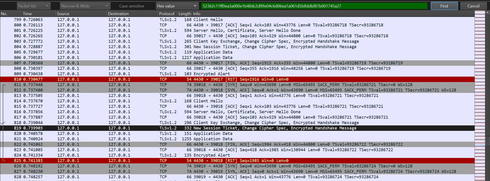
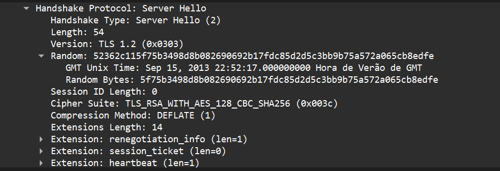
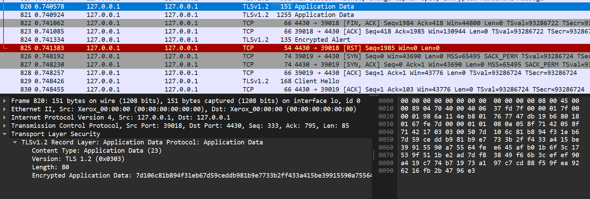
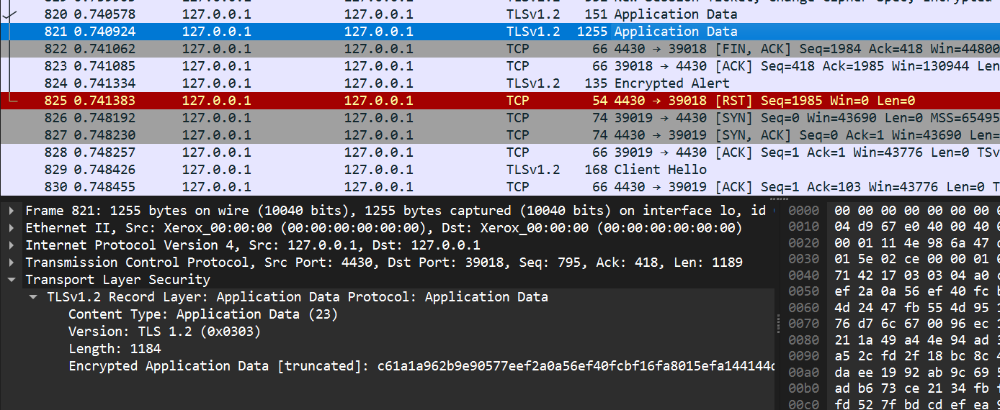
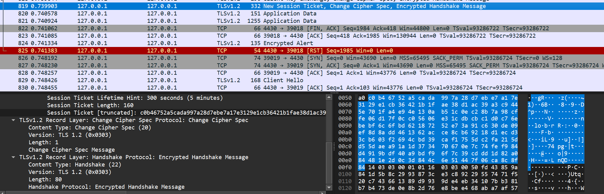

# SEED Labs - Sniffing and Spoofing

## Task 1

### Setup

Começamos por utilizar o comando ```dcbuild```, de seguid do comando ```dcup``` para incializarmos o docker.
De seguida utilizamos o comando ```dockps```

### Task 1.1.A

- Depois de termos começado o docker, incializamos dois novos terminais. No 1º utilizamos o comando ```docksh seed-attacker``` e no 2º o comando ```docksh hostA-10.9.0.5```.
- No terminal do attacker utilizamos o comando ``ìfconfig``` percebendo que a noss interface será br-95e4991e848b.

- 

- De seguida utilizamos o seguinte script de python no terminal do attacker atribuíndo-lhe as seguintes permissões ```chmod a+x task1.1.py```:
```#!/usr/bin/env python3

from scapy.all import *
def print_pkt(pkt):
	pkt.show()

pkt = sniff(iface='br-95e4991e848b', filter='icmp', prn=print_pkt)
```

- Depois de colocarmos o attacker em "Sniffing", no segundo terminal demos ping em 10.9.0.6 e percebemos que o terminal do attacker capturou os packets transmitidos.

- 

- Experimentamos por fim efetuar o mesmo script mas sem permissões de admistrador e concluímos que não foi possível caputar os packets a partir do attacker.


### Task 1.1.B

- Primeiramente utilizamos o seguinte filtro para apenas recebermos o "ICMP" ```pkt = sniff(iface='br-95e4991e848b', filter='icmp', prn=print_pkt)```.

- Para capturarmos o packet do IP 10.9.0.5 com a porta 23 utilizamos o seguine filtro ``pkt = sniff(iface='br-95e4991e848b', filter='tcp and host 10.0.0.5 and port 23', prn=print_pkt)``

- Finalmente, para capturarmos o packet de uma subnet, utilizamos este filtro ``pkt = sniff(iface='br-95e4991e848b', filter='128.230.0.0/16', prn=print_pkt)``

## Task 1.2


# CTF  Find-my-TLS

- Começamos por descarregar o ficheiro fornecido e abri-lo utilizando o wireshark. De seguinda utilizamos um filtro "Hex Value" e colocamos o valor "52362c11ff0ea3a000e1b48dc2d99e04c6d06ea1a061d5b8ddbf87b001745a27" para percebermos qual a mensagem que deveríamos investigar.

- Percebemos aí que a transmissão que nos interessava era do 814 até ao 828.



- Desta forma, percebmos que o "frame_start" é 814 e o "frame-end" é 819, visto que é nesse frame em que o handshake termina.

- Para percebermos o "selected_cipher_suite" verificámos no frame 816 qual o cipher_suite utilizado sendo este "TLS_RSA_WITH_AES_128_CBC_SHA256".



- De forma a calcularmos a "total_encrypted_appdata_exchanged" verificamos nos frames correspondentes à application data o tamanho dos dados cifrados e somamos os mesmos obtendo o valor de 1264(80+1184).





- Finalmente, para sabermos o tamanho da mensagem cifrada no handshake que concluí o procedimento "size_of_encrypted_message", fomos ao frame onde termina o handshake (819) e verificamos apenas o tamanho da mensagem que é 80.



- Concluímos assim que a flag seria flag{814-819-TLS_RSA_WITH_AES_128_CBC_SHA256-1264-80}


