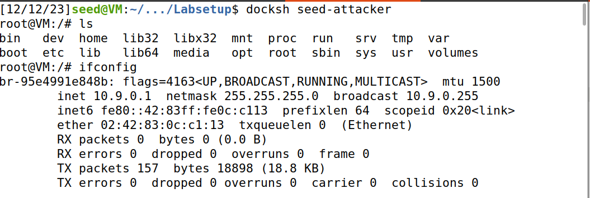
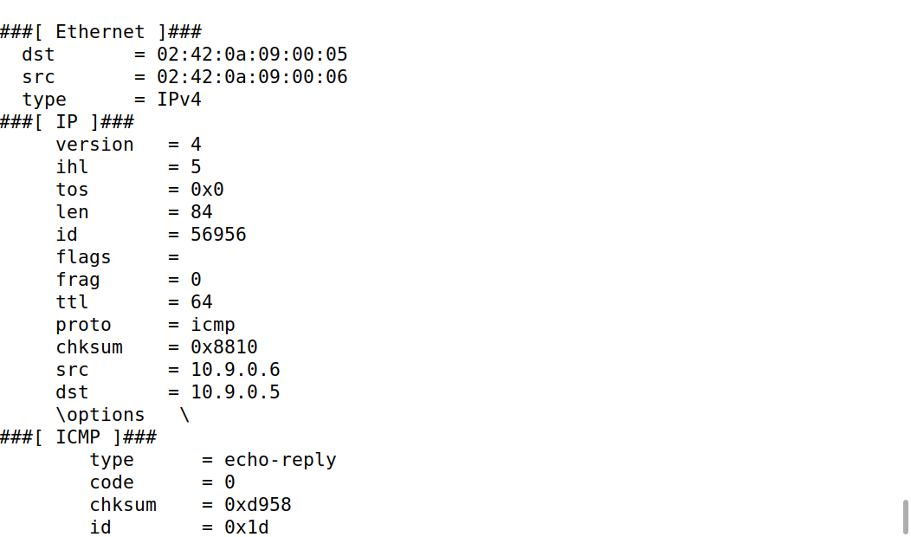

# SEED Labs - Sniffing and Spoofing

## Task 1

### Setup

Começamos por utilizar o comando ```dcbuild```, de seguid do comando ```dcup``` para incializarmos o docker.
De seguida utilizamos o comando ```dockps```

### Task 1.1.A

- Depois de termos começado o docker, incializamos dois novos terminais. No 1º utilizamos o comando ```docksh seed-attacker``` e no 2º o comando ```docksh hostA-10.9.0.5```.
- No terminal do attacker utilizamos o comando ``ìfconfig``` percebendo que a noss interface será br-95e4991e848b.

- 

- De seguida utilizamos o seguinte script de python no terminal do attacker atribuíndo-lhe as seguintes permissões ```chmod a+x task1.1.py```:
```#!/usr/bin/env python3

from scapy.all import *
def print_pkt(pkt):
	pkt.show()

pkt = sniff(iface='br-95e4991e848b', filter='icmp', prn=print_pkt)
```

- Depois de colocarmos o attacker em "Sniffing", no segundo terminal demos ping em 10.9.0.6 e percebemos que o terminal do attacker capturou os packets transmitidos.

- 

- Experimentamos por fim efetuar o mesmo script mas sem permissões de admistrador e concluímos que não foi possível caputar os packets a partir do attacker.


### Task 1.1.B

- Primeiramente utilizamos o seguinte filtro para apenas recebermos o "ICMP" ```pkt = sniff(iface='br-95e4991e848b', filter='icmp', prn=print_pkt)```.

- Para capturarmos o packet do IP 10.9.0.5 com a porta 23 utilizamos o seguine filtro ``pkt = sniff(iface='br-95e4991e848b', filter='tcp and host 10.0.0.5 and port 23', prn=print_pkt)``

-Finalmente, para capturarmos o packet de uma subnet, utilizamos este filtro ``pkt = sniff(iface='br-95e4991e848b', filter='128.230.0.0/16', prn=print_pkt)``

## Task 1.2


