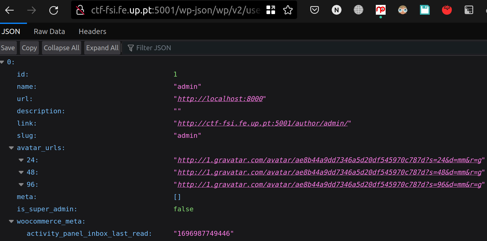
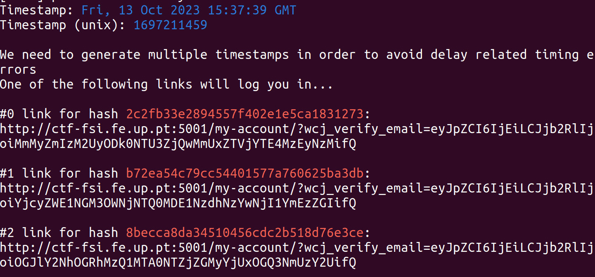
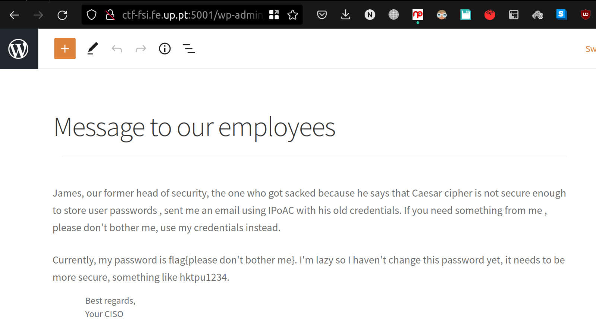

# CTF Semana #3 (Wordpress CVE)
 
>Reconhecimento, Pesquisa e Escolha de Vulnerabilidades
-  Iniciamos por fazer um inspect ao html do website para recolher informação sobre a versão do Wordpress e plugins instalados. 
    Ao perceber que o Wordpress estava desatualizado, procuramos por vulnerabilidades conhecidas na versão 5.8.1 lançada em 2021 que permitiam fazer login como outro utilizador e envolviam o plugin *Woocommerce* e encontramos a vulnerabilidade **[CVE-2021-34646](https://www.cvedetails.com/cve/CVE-2021-34646/?q=CVE-2021-34646)**.
> Exploit

Procuramos por exploits para a vulnerabilidade e encontramos um [exploit](https://www.exploit-db.com/exploits/50299) para o Booster for Woocommerce plugin.

> O script ajusta os timestamps de data/hora e usa a função de hash MD5 junto com a codificação Base64 para criar os tokens necessários para construir as URLs que contornam a autenticação. Isso nos permite acessar o site com privilégios de administrador

1. Descobrimos o ID do admin acessando: http://ctf-fsi.fe.up.pt:5001/wp-json/wp/v2/users/

2. Executamos o exploit usando o URL base e o ID encontrado
~~~
sudo python3 exploit_CVE-2021-34646.py http://ctf-fsi.fe.up.pt:5001/ 1 
~~~

Ao acessar um dos links gerados, entramos como administrador

