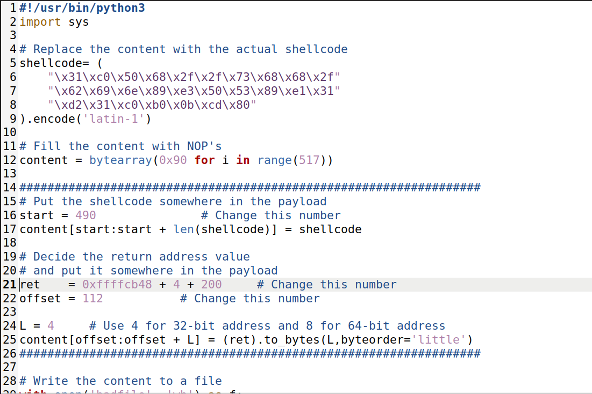
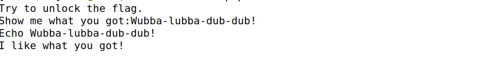
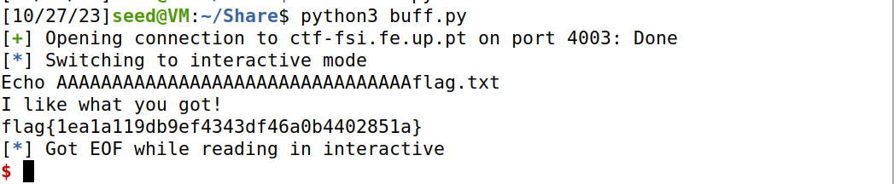

**Task 1:**

- Desligar as medidas de segurança para que as variáveis possam ser as mesmas.
- Ligar a shell ao /bin/sh para que o programa seja executado.
- Compilar e perceber que ambas as versões nos deram acesso à shell.


**Task 2:**

- Compilar o programa de forma a correr os comandos para tornar o programa Set-UID,


- Usando ls -l viu-se as permissões do programa confirmando o Set-UID.


**Task 3:**

- Inicialmente, corremos o programa no modo debug para percebermos a localização do inicio do buffer e do endereço do overflow na stack. Para isso colocamos um breakpoint na função bof.
- Vimos de seguida, $ebp e o &buffer.


- Depois alteramos as seguintes varáveis no script de python:
- - Colocamos o start a 490 para o início do shellcode no buffer estar no final do buffer.
- - Colocamos o offset a 112, que é a distância entre o início do buffer e a address do return mais 4.
- - Colocamos o ret a 0xffffcb48 + 4 + 200 para ser a address para onde queremos que o programa salte e por nop slide chegue no shell code.



- Corremos o script e depois o programa e obtivemos uma shell com previlégios de root.


**Task 4:**

- A única informação que temos é que o tamanho do buffer é de 100 a 200 bytes.
- Por investigação podemos obter o endereço do buffer com p &buffer de 0xffffcab0.
- Verificámos que o shell code tinha 27 bytes de comprimento, portanto definimos o start como 490.
- Definimos o ret como 0xffffcab0 + 200 + 200, ou seja, 0xffffcab0 do endereço do buffer adicionado ao tamanho máximo do buffer, 200 bytes, adicionado a 200 bytes, grande o suficiente para ter em conta os diferentes adereços num ambiente sem debug e pequeno o suficiente para não ultrapassar o inicio do shell code.
- Para o offset usámos um for loop para colocarmos o return address em vários sítios e pelo menos um estar no sitio certo, pois começa no buffer address e é colocado a cada 4 bytes.

**Terminal**


**exploit.py**


**Badfile depois de exploit.py**


## CTF (Buffer Overflow)

### DESAFIO 1

Pudemos notar que o serviço **ctf-fsi.fe.up.pt:4003** a correr o programa realizava um echo do input do utilizador e decidimos nos aproveitar dessa vulnerabilidade.


Com os ficheiros fornecidos, depois de uma análise ao código do main.c, pudemos notar que o *scanf()* permite-nos ler até 8 bytes além do limite da variável *buffer* com 32 bytes. 

**main.c**
```c
char meme_file[8] = "mem.txt\0";
char buffer[32];
...
scanf("%40s", &buffer);
```

Com isso, assumindo que na stack temos a váriavel *meme_file* e sabemos que ela está a ser usada pelo programa para abrir um ficheiro, com a ajuda do exploit *exploit-example.py* que interaje com o serviço. Aproveitamo-nos desse 'oversight' do scanf e mandamos uma payload de 32 bytes + o nome do ficheiro que pretendemos lêr.

```python
r.recvuntil(b":")
payload = b"A" * 32 + b"flag.txt"
r.sendline(payload)
```

Resultando em: 



