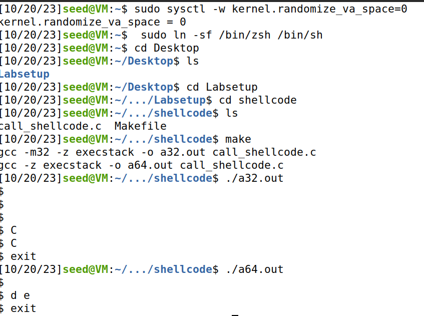
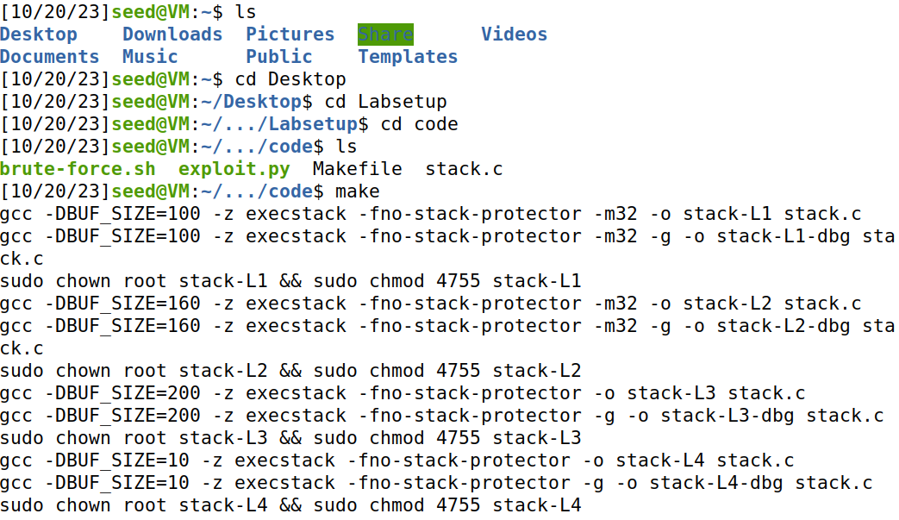
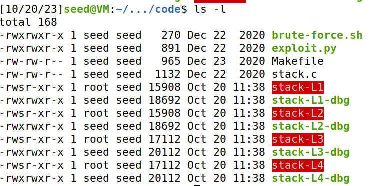
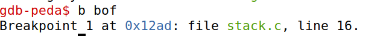
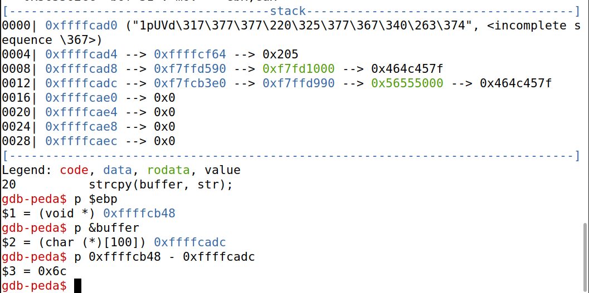

**Task 1:**
- Desligar as medidas de segurança para que as variáveis possam ser as mesmas.
- Ligar a shell ao /bin/sh para que o programa seja executado.
- Compilar e perceber que ambas as versões nos deram acesso à shell.

**Task 2:**
- Compilar o programa de forma a correr os comandos para tornar o programa Set-UID,

- Usando ls -l viu-se as permissões do programa confirmando o Set-UID.

**Task 3:**
- Inicialmente, corremos o programa no modo debug para percebermos a localização das variáveis na stack. Colocamos um breakpoint.
- Vimos de seguida, $ebp e o &buffer.

)
)

- Depois alteramos as seguintes varáveis no script de python:
- - Colocamos o start a 490 para o início do shellcode no buffer ser igual à posição para onde o programa salta.
- - Colocamos o offset a 112, que é a distância entre o início do buffer e a address do return.
- - Colocamos o ret a 0xffffcb48 + 4 + 200 para ser a address para onde queremos que o programa salte.

)

- Corremos o script e depois o programa e obtivemos uma shell com previlégios de root.

**Task 4:**

)

